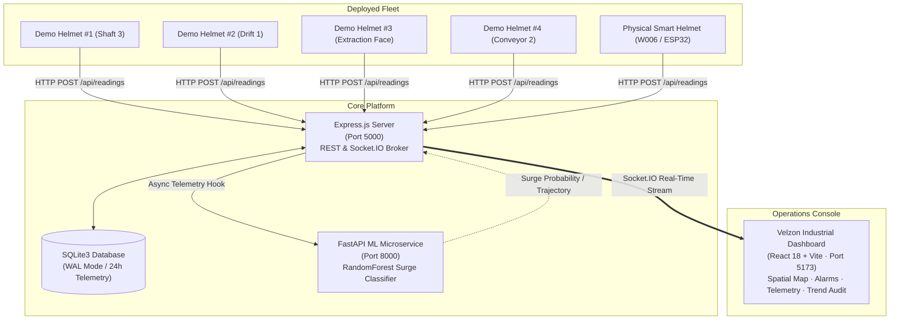

# MineGuard — Industrial Smart Helmet Safety & Telemetry Platform

[](https://nodejs.org)
[](https://react.dev)
[](https://fastapi.tiangolo.com)
[](https://www.python.org)
[](https://vitejs.dev)
[](https://tailwindcss.com)
[](https://opensource.org/licenses/MIT)

**MineGuard** is an industrial-grade IoT safety monitoring and early-warning operations console engineered for underground mining and hazardous industrial environments. 

It connects deployed miner smart helmets (powered by ESP32 microcontrollers) with a real-time supervision dashboard and an asynchronous **temporal Machine Learning gas surge advisory microservice**. The system monitors toxic/combustible gases (MQ-2, MQ-5), biometric vitals (pulse, SpO2), barometric pressure, temperature, and emergency SOS/fall states with both **deterministic safety thresholds** and **proactive ML rate-of-change trajectory classification**.

---

## 🏗️ System Architecture



### 1. Operations Console (`client/` — Port 5173)
* **Design System**: Industrial admin console inspired by Velzon and Siemens operations dashboards. Features a persistent dark navy sidebar (`#182B3A`), white top utility bar, and soft neutral page background (`#F3F6F8`).
* **Official Branding**: Integrated MineGuard SVG brand pack with adaptive desktop wordmark and collapsed mobile shield mark.
* **Spatial Mine Architecture Map**: Dynamic SVG mine tunnel network with live multi-node airflow vectors and color-coded telemetry status (Nominal, Elevated, Critical, Standby).
* **Standby Telemetry Presentation**: Units awaiting hardware packets show clear `—` dashes instead of misleading synthetic fallbacks.
* **Interactive Hackathon Demo Mode**: 40-second scenario with deterministic stage progression and emergency siren audio.

### 2. Backend Ingestion & Broker (`server/` — Port 5000)
* **Ingestion API**: Express.js REST endpoints with write-budget management, payload schema validation, and immediate client broadcast over Socket.IO.
* **Deterministic Safety Engine**: Instantaneous alert evaluation for gas limits ($> 2000\text{ mV}$ warning, $> 2500\text{ mV}$ critical), pulse boundaries, and SOS/fall signals.
* **Storage Layer**: SQLite3 database running with Write-Ahead Logging (WAL) and dual-adapter support for cloud deployments.

### 3. Machine Learning Surge Microservice (`ml_service/` — Port 8000)
* **Temporal Predictive Modeling**: FastAPI microservice serving a serialized `RandomForestClassifier` trained on resampled atmospheric coal mine telemetry.
* **Dimensionless Features**: Extracts normalized linear regression slope, 1-minute relative rate of change, 5-minute volatility ($CV$), and standardized $z$-score deviation.
* **Advance Warning**: Predicts combustible gas surges **5 to 10 minutes in advance** before critical thresholds are breached.
* **Adaptive Warm-Up**: Instantly evaluates live hardware packets from physical helmet `W006` without requiring a 10-minute buffer delay.

---

## ⚡ Quick Start & Startup Commands

To run the complete MineGuard ecosystem, launch the three primary services in separate terminal windows:

### Terminal 1: Python ML Microservice
```powershell
cd Smart-Helmet
py -3.14 -m uvicorn ml_service.main:app --host 127.0.0.1 --port 8000
# Runs on http://127.0.0.1:8000 (Health check: http://127.0.0.1:8000/health)
```

### Terminal 2: Node.js Backend Server
```powershell
cd Smart-Helmet
npm run dev --workspace=server
# Runs on http://localhost:5000
```

### Terminal 3: React Frontend Console
```powershell
cd Smart-Helmet
npm run dev --workspace=client
# Runs on http://localhost:5173
```

### Terminal 4 (Optional): Telemetry Simulator
```powershell
cd Smart-Helmet
npm run simulate
# Broadcasts realistic multi-sensor telemetry for Demo Helmets #1–#4 every 2 seconds
```

Open **`http://localhost:5173`** in your browser to access the dashboard.

---

## 🔬 Deterministic Rules vs. Machine Learning

A common question in industrial safety is: *Why use Machine Learning instead of a simple `if` condition?*

| Capability | Reactive Rule (`if (gas >= 2500)`) | Temporal ML Surge Classifier (`v1.1`) |
| :--- | :--- | :--- |
| **Detection Mechanism** | Compares instantaneous value against static threshold. | Evaluates rate of change ($\Delta$), linear slope, volatility ($CV$), and $z$-score. |
| **Response Window** | **Purely Reactive** — Alerts only *after* toxic gas has saturated the drift. | **Proactive** — Provides **5 to 10 minutes of advance warning** while levels are still sub-critical. |
| **Sudden Gas Desorption**<br>*(Gas rises from 1100 to 1600 mV in 15 seconds)* | **Does nothing** — 1600 mV is below the 2000 mV warning limit. | **Triggers 88% surge probability** — Detects steep positive acceleration and flags `RISING` trajectory. |
| **Sensor Baseline Drift**<br>*(Gas lingers at 1700 mV for hours due to humidity)* | May trigger nuisance alarms near threshold boundaries. | **Nominal (~4% risk)** — Recognizes zero slope and stable standard deviation. |

---

## 🪖 Live Hardware Testing: Physical Helmet (W006)

The system includes dedicated support for a physical ESP32 Smart Helmet assigned to worker **`W006`** (`H-ESP32-LIVE`).

### Testing with a Lighter (Hydrocarbon Gas Surge):
1. Power on the ESP32 helmet and connect it to Wi-Fi.
2. The helmet will transmit packets via `POST /api/readings`. The dashboard card will immediately switch from `Standby` to `Online`.
3. **Bring an unlit butane lighter near the MQ-2 sensor** (releasing butane gas):
   - Sensor output spikes from nominal (~1200 mV) to **2400–2800+ mV**.
   - The ML service detects the massive rising slope and classifies `W006` as **`CRITICAL_SURGE_RISK`** with **88%–95% surge probability** and **`RISING`** trajectory.
   - The *“Experimental gas surge risk advisory”* card on the Overview page locks onto `W006`, highlighting the surge in real-time.
4. Release the lighter: As fresh air restores the baseline, the slope turns negative and the ML risk level returns to `NORMAL` (`FALLING` trajectory).

---

## 📡 Sensor Ingestion Payload Schema

Hardware nodes post JSON payloads to `POST /api/readings`:

```json
{
  "worker_id": "W006",
  "helmet_id": "H-ESP32-LIVE",
  "temperature": 27.8,
  "humidity": 62.4,
  "mq2_mv": 1240,
  "mq5_mv": 1180,
  "mq2_raw": 1540,
  "mq5_raw": 1460,
  "heart_rate": 76,
  "spo2": 98,
  "pressure": 1013.2,
  "battery": 88,
  "sos": false,
  "fall": false,
  "communication": "wifi",
  "gateway_id": "direct",
  "timestamp": "2026-10-09T02:00:00.000Z"
}
```

*Note: All telemetry fields except `worker_id` are optional and handled gracefully.*

---

## 🧪 Testing & Validation Suite

Run the automated backend test suites covering database write budgets, rate limiting, and ML integration:

```powershell
cd Smart-Helmet
# Run backend test suite
npm test --workspace=server

# Run ML microservice unit tests
py -3.14 -m pytest ml_service/tests
```

---

## 📁 Repository Structure

```text
Smart-Helmet/
├── client/                     # React 18 + Vite Operations Console
│   ├── public/                 # Favicons, webmanifest, SVG logo pack
│   └── src/
│       ├── assets/             # MineGuard brand asset pack
│       ├── components/         # Overview, WorkerDetail, Spatial Map, HackathonDemoPanel
│       ├── context/            # AppContext (Socket.IO streams, memoized handlers)
│       └── mineguard-ui.css    # Velzon-inspired design system tokens
├── server/                     # Node.js + Express Broker & Ingestion Service
│   ├── src/
│   │   ├── db/                 # SQLite3 WAL adapter & schema migrations
│   │   ├── services/           # ML client broker & alert evaluation engine
│   │   └── simulator/          # Multi-miner telemetry stream generator
│   └── tests/                  # Integration and pressure tests
├── ml_service/                 # FastAPI ML Early Warning Microservice
│   ├── features/               # Scale-invariant dimensionless feature extractor
│   ├── models/                 # Serialized RandomForest model & scaler pipelines
│   └── main.py                 # FastAPI inference endpoints with adaptive warm-up
└── mineguard_project_docs/     # Architecture RFCs and audit documentation
```

---

## 🛡️ License & Operational Notice

Released under the **[MIT License](LICENSE)**.

> **Operational Notice:** MineGuard is an advanced educational and prototype platform engineered for college hackathons, technical demonstrations, and research evaluation. It is not certified intrinsically safe (IS) for explosive methane atmospheres (ATEX / MSHA certification required for actual coal face deployment).
